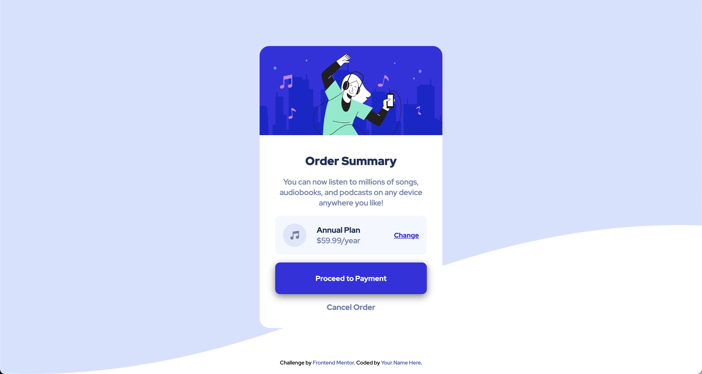

# Frontend Mentor - Order summary card solution

This is a solution to the [Order summary card challenge on Frontend Mentor](https://www.frontendmentor.io/challenges/order-summary-component-QlPmajDUj). Frontend Mentor challenges help you improve your coding skills by building realistic projects. 

## Table of contents

- [Overview](#overview) 
  - [Screenshot](#screenshot)
  - [Links](#links)
- [My process](#my-process)
  - [Built with](#built-with)
  - [What I learned](#what-i-learned)
  - [Continued development](#continued-development)
- [Author](#author)
- [Acknowledgments](#acknowledgments)

## Overview

### Screenshot

### Links

- Solution URL: [GitHub Pages](https://your-solution-url.com)

## My process

### Built with

- Semantic HTML5 markup
- CSS custom properties
- Flexbox
- Mobile-first workflow

### What I learned

Like Kevin Powell says, web content is responsive from the start and if it's not, it's usually your own fault. Instead of doing anything with the image, I designed the card first, whereafter I only needed to assing a width of 100% to the image to display it properly.

### Continued development

Give the whole card a 3d hover state that follows the cursor.

## Author

- Frontend Mentor - [@dragonfireshield](https://www.frontendmentor.io/profile/dragonfireshield)
- Twitter - [@shieldfordragon](https://www.twitter.com/shieldfordragon)

## Acknowledgments

Thanks to my frontendmentor.io peers who commented on my first three projects, this time I added an image alt attribute and for the svg icon and aria hidden.